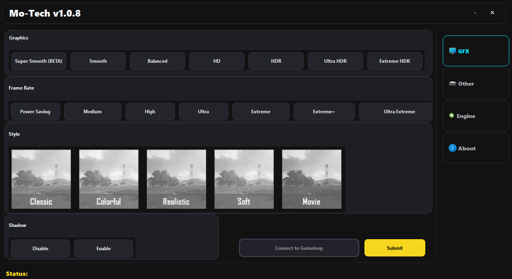
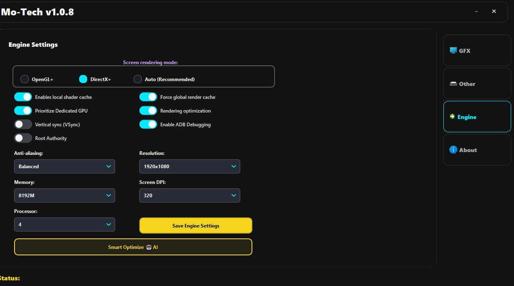
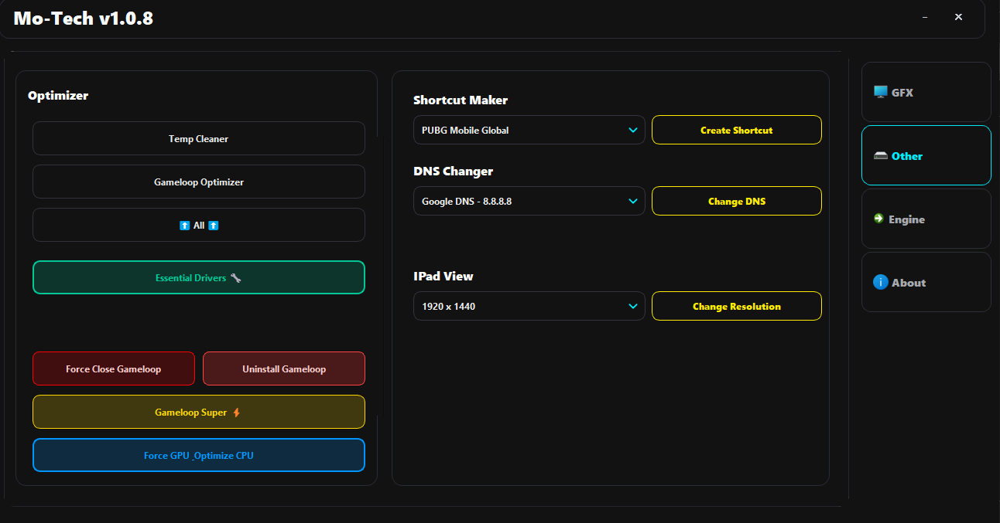

<div align="center">
  
  <h1>Mo-Tech pubgm</h1>
  <p><b>The Ultimate GameLoop & PUBG Mobile Optimization Suite</b></p>
  
  [](https://microsoft.com)
  [](https://python.org)
  [](#)
  [](#)
</div>

---

## 📖 About The Project

**Mo-Tech pubgm** is an advanced, all-in-one utility tool crafted specifically for Windows users who want to unlock the absolute maximum potential of GameLoop and PUBG Mobile. 

Whether you are suffering from micro-stutters, low FPS, or slow rendering, Mo-Tech safely bypasses emulator limits, heavily optimizes your Windows environment, and configures the game engine to provide a silky-smooth, competitive gaming experience.

---

## ✨ Outstanding Features

### 🎮 GFX & FPS Control
- **Unlock Limits:** Safely force up to **120 FPS** (Extreme+ / Ultra Extreme).
- **Graphics Presets:** Switch easily between Smooth, Balanced, HD, HDR, and Ultra HDR.
- **Visual Styles:** Apply Classic, Colorful, Realistic, Soft, or Movie visual profiles instantly.

### ⚙️ Engine Level Tweaking *(Under the Hood)*
- **Smart Rendering Mode:** Swap between *DirectX+* (For raw GPU performance) and *OpenGL+* (For stability).
- **Hardcore Caching:** Enable Shader Caching and Global Rendering Cache to eliminate mid-fight stutters.
- **Hardware Priority:** Force GameLoop to bypass integrated graphics and lock onto your Dedicated GPU (Nvidia/AMD).
- **RAM & CPU Allocation:** Assign exact RAM modules (up to 8GB) and CPU cores to the emulator.

### 🚀 The "Optimizer" Arsenal
- **Gameloop Super ⚡:** A one-click feature to launch GameLoop with absolute VIP Windows Priority natively.
- **Magic Button:** Automatically cleans Temp files, executes secret registry tweaks, and adds GameLoop to Windows Defender Exclusions.
- **Essential Drivers:** Automatically detects and installs missing Visual C++ runtimes to prevent game crashes.
- **Complete Root Uninstaller:** A nuclear option to rip out GameLoop, leftover AppData, and hidden registry keys if you need a fresh start.

### 🛠️ Extra Utilities
- **DNS Changer:** Apply top-tier gaming DNS (Google, Cloudflare, etc.) or custom addresses to lower your ping.
- **iPad View:** Modify emulator dimensions and apply 16:10 / 4:3 custom stretch resolutions seamlessly.
- **Custom Desktop Shortcuts:** Generate beautiful desktop shortcuts for specific app packages instantly.

---

## 📸 Screenshots Showcase

> **Note:** *To display your app images here on GitHub, create a folder named `screenshots` next to this README, capture pictures of the app, and name them `main.png`, `engine.png`, `optimizer.png`, and `about.png`.*

<div align="center">
  
  
</div>
<br>
<div align="center">
  
  
</div>

---

## 💻 Installation & Usage

### Option 1: Run Pre-Built Executable (Easiest)
1. Download the latest `Mo-Tech pubgm.exe` from the **Releases** section.
2. Right-click the `.exe` file and select **"Run as Administrator"** *(Crucial for registry and engine tweaks to apply!)*.
3. Connect your GameLoop emulator from the UI and start optimizing!

### Option 2: Build From Source
If you are a developer and wish to compile the project yourself:
```bash
# 1. Clone the repository
git clone https://github.com/mohammad-emad9/Mo-Tech.git

# 2. Navigate to the directory
cd Mo-Tech

# 3. Install required dependencies
pip install -r requirements.txt

# 4. Compile the project effortlessly using the smart build script!
build.bat
```
*The final standalone executable will be magically bundled inside the `dist/` folder.*

---

## ⚠️ Important Disclaimer

- This application modifies Windows system settings, registry keys, and emulator configuration files to boost performance. **Always run as Administrator** to avoid access errors.
- **Mo-Tech pubgm** is an independent utility and is **NOT** officially affiliated with, endorsed by, or connected to PUBG Mobile, Tencent, Level Infinite, or GameLoop. 
- Use the tool respectfully and at your own risk.

---

## 👨‍💻 Developed By

<div align="center">
  <h3>Mohammed Emad</h3>
  <p>
    <a href="https://github.com/mohammad-emad9"></a>
    <a href="https://discord.com/users/elitemohmmad"></a>
  </p>
</div>
